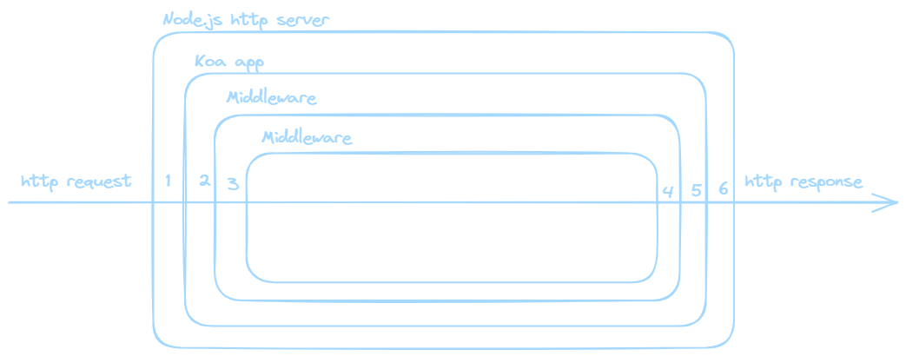

# Node.js

ITS 2024-25

---

# Installa Node.js

Prerequisiti

- GIT: [https://git-scm.com](https://git-scm.com )

Installazione consigliata

- Installa Volta: [https://volta.sh ](https://volta.sh )
- Apri git bash:
  - `curl https://get.volta.sh | bash`
  - `volta install node`

--

# Crea un nuovo progetto Node.js

- Crea una nuova cartella
- Apri git bash e posizionati nella cartella del progetto
  - `npm init`
    - segui le istruzioni
  - `volta pin node`: imposta la versione corrente di Node.js

---

# Ripasso di javascript

---

## Const

Il valore di una costante non può essere modificato

```js
const invariabile = 5;
invariabile = 6; // NO! 
// TypeError: Assignment to constant variable.
```

--

## Const

Se la costante è un oggetto o un array,
le sue proprietà o i suoi elementi
possono essere modificati!

```js
const nomeCostante = {}; // Oggetto

nomeCostante.proprieta = 1; // OK: 
// ho modificato una proprietà dell'oggetto, 
// ma non l'oggetto in sè
```

--

## Let

Può cambiare nel tempo

```js
let nomeLet = "valore";

nomeLet = {
  proprieta: "valore",
  altra: 123
};
```

Si può fare, ma non è consigliato modificare il tipo di dato di una variabile!

--

## Var

Sintassi valida ma non più in uso

```js
var nomeVariabile = "valore";
```

---

## Oggetti

```js
const myObject = {
  proprieta1: "valore",
  proprieta2: "altro valore"
};
```

Accedere al valore di una proprietà:

```js
// sintassi equivalenti
const proprieta1 = myObject["proprieta1"];

const proprieta2 = myObject.proprieta2;
```

---

## Array

```js
const myArray = ["valore 1", 123, true, "..."];
```

Accedere al valore in una determinata posizione:

```js
const primoElementoDellArray = myArray[0]; // "valore 1"
```

--

## Metodi degli array

forEach(callback)

```js
myArray.forEach((el) => {
  el = el + "stringa";
});
```

Modifica ogni elemento dell'array, applicando la funzione di callback

```js
myArray === myArray; // true: 
// vengono modificati gli elementi dell'array
```

--

## Metodi degli array

map(callback)

```js
const newArray = myArray.map((el) => {
  el = el + "stringa";
  return el;
})
```

Ritorna un nuovo array, con gli elementi modificati dalla callback

```js
newArray === myArray; // false
// il metodo map() genera un nuovo array
```

--

## Altri metodi degli array

- `Sort:` riordina gli elementi dell’array
- `Find:` trova un elemento
- `Filter`: elimina alcuni elementi
- `Reduce`: elabora tutti gli elementi in un unico risultato
- `Join:` unisce due o più array

--

## Approfondisci

[https://developer.mozilla.org/en-US/docs/Web/JavaScript/Guide/Loops_and_iteration](https://developer.mozilla.org/en-US/docs/Web/JavaScript/Guide/Loops_and_iteration)

---

## Funzioni

```js
const miaFunzione = function nomeFunzione() {
  //...
}

const miaArrowFunction = () => {
  //...
}

const funzioneConParametri = (param1, param2) => {
  return param1 + " " + param2;
}
```

--

## First class functions

Si può assegnare una funzione a una variabile

```js
const foo = () => {
  console.log("foobar");
};
foo();
```

--

## First class functions

Si può passare una funzione come argomento di un'altra funzione

```js
function sayHello() {
  return "Hello, ";
}

function greeting(helloMessage, name) {
  console.log(helloMessage() + name);
}

// Pass `sayHello` as an argument to `greeting` function
greeting(sayHello, "JavaScript!");

// Hello, JavaScript!
```

--

## First class functions

Una funzione può ritornare una nuova funzione

```js
function sayHello() {
  return () => {
    console.log("Hello!");
  };
}
```

--

## Approfondisci

[https://developer.mozilla.org/en-US/docs/Glossary/First-class_Function](https://developer.mozilla.org/en-US/docs/Glossary/First-class_Function)


--

## Currying

Funzioni che ritornano altre funzioni, con una sintassi fluida

```js
const chiama = (nome) => (functionCognome) => {
  return nome + " " + cognome;
}

// posso chiamarla così:
chiama("Mario")("Bianchi");

// oppure in diversi step,
// assegnando a una variabile la funzione generata:
const chiamaPaolo = chiama("Paolo");
chiamaPaolo("Rossi"); 
```

--

## Approfondisci

[https://it.javascript.info/currying-partials](https://it.javascript.info/currying-partials)

--

## Composizione di funzioni

```js
const famigliaRossi = (nome) => {
  return nome + " Rossi";
}

const famigliaBianchi = (nome) => {
  return nome + " Bianchi";
}

const chiamaConNomeCompleto = (nome, functionCognome) => {
  return functionCognome(nome);
}

chiamaConNomeCompleto("Mario", famigliaBianchi);
chiamaConNomeCompleto("Paolo", famigliaRossi);
```

---

## Funzioni asincrone

```js {data-trim data-line-numbers="|13|19|14|15|16|20|7-11|21|1-5|22"}
function salutamiDopo() {
  setTimeout(() => {
    console.log("Ciao");
  }, 1000);
}

const chiamaDopo = (nome) => {
  setTimeout(() => {
    console.log("Ehi, " + nome + "!");
  }, 0); // timeout = zero
}

console.log("Inizio");
salutamiDopo();
chiamaDopo("Mario");
console.log("Fine");

// Console:
// Inizio
// Fine
// Ehi, Mario!
// Ciao
```

--

## Approfondisci

/i/https://youtu.be/N0Au8yc5IOw?si=T0TvfQ-4fFJJL1Gi

[JavaScript Event Loop](https://youtu.be/N0Au8yc5IOw?si=T0TvfQ-4fFJJL1Gi)

--

## Come posso controllare il flusso di una sequenza di funzioni asincrone?

--

## Callback

```js {data-trim data-line-numbers="|14|1-6|17|4|8-12|18"}
function saluta(cb) {
  setTimeout(() => {
    console.log("Ciao");
    cb(); // <- esegue la callback
  }, 1000);
}

const chiama = (nome) => {
  setTimeout(() => {
    console.log("Ehi, " + nome + "!");
  }, 0);
}

saluta(() => chiama("Paolo"));

// Console:
// Ciao
// Ehi, Paolo!
```

--

### Attenzione

La funzione `chiama()` si aspetta un parametro.

Poiché la funzione `saluta()` non passa nessun parametro alla callback,  
`chiama("Paolo")` viene eseguita in una callback che non ha parametri!

```js
saluta((/* nessun parametro */) => chiama("Paolo"));
```

--

## Promise

```js {data-trim data-line-numbers="|19|2|5|11|14"}
function saluta() {
  return new Promise((resolve) => {
    setTimeout(() => {
      console.log("Ciao");
      resolve();
    }, 1000);
  });
}

const chiama = (nome) => {
  return new Promise((resolve) => {
    setTimeout(() => {
      console.log("Ehi, " + nome + "!");
      resolve();
    }, 0); 
  });
}

saluta().then(() => chiama("Paolo"));
```

--

## Approfondisci

[https://developer.mozilla.org/en-US/docs/Web/JavaScript/Reference/Global_Objects/Promise](https://developer.mozilla.org/en-US/docs/Web/JavaScript/Reference/Global_Objects/Promise)

--

## Async/await

```js {data-trim data-line-numbers="|26|19|20|21|1-8|4|5|22|10-17|13|14|23"}
async function saluta() {
  return new Promise((resolve) => {
    setTimeout(() => {
      console.log("Ciao");
      resolve();
    }, 1000);
  });
}

const chiama = async (nome) => {
  return new Promise((resolve) => {
    setTimeout(() => {
      console.log("Ehi, " + nome + "!");
      resolve();
    }, 0); 
  });
}

const main = async () => {
  console.log("Inizio");
  await saluta();
  await chiama("Paolo");
  console.log("Fine");
}

main();
```

---

## [Typescript](https://www.typescriptlang.org/)

E' un **superset** di javascript, cioè "arricchisce" javascript. In particolare, permette di descrivere dettagliatamente ogni tipo di dato e funzione.

- è integrato nell'editor e permette di segnalare errori nel codice
- può fare il **parsing** del codice per segnalare errori prima della sua esecuzione
- trasforma il codice typescript in javascript eseguibile nel browser o in node.js (**transpiling**)

--

Tutto il codice javascript è anche typescript valido.

Typescript, invece deve essere compilato in javascript, per diventare codice javascript valido.

--

## Esempio

```typescript
type User = {
  name: string,
  id: number,
}
 
const user: User = {
  username: "Hayes", // Error: it doesn't match the type
  id: 0,
};
```

--

### Vantaggi pratici di typescript

- fornisce suggerimenti durante la scrittura del codice
- permette di fare refactoring in modo sicuro
- permette di individuare errori di spelling
- aggiunge un controllo strict sui quirks&flaws di javascript
- in fase di compilazione, segnala errori che altrimenti non sarebbero rilevabili in javascript

--

> Typescript è uno standard per la realizzazione di applicazioni con un minimo di complessità.

---

## Lavorare con molti file

/i/https://youtu.be/5zl1jJGCzVI?si=3RVrZE9Y_HO2KWaz

- [Visually explained: Bundling in 60 seconds](https://youtu.be/5zl1jJGCzVI?si=3RVrZE9Y_HO2KWaz)
- [Documentazione di `export`](https://developer.mozilla.org/en-US/docs/Web/JavaScript/Reference/Statements/export)
- [Documentazione di `require()` in node.js](https://nodejs.org/docs/v20.18.0/api/modules.html#requireid)

--

## Import / export

```js
// a.js

export const myFunction = () => {
  // ...
}
```

```js
// b.js

import {myFunction} from "./a.js"

myFunction();
```

---

## Framework Node.js per applicazioni server

- Express.js
- [Koa](https://koajs.com/)  *(useremo questo)*
- Fastify
- Nestjs
- ...molti altri

--

## Koa

```js
import Koa from "koa";

const app = new Koa();

app.listen(3000); // fa partire il server
```

--

## Middleware



```js
async function Middleware(ctx, next) {
  // ... fai qualcosa e modifica ctx (context)
  await next(); // esegue il prossimo middleware
  // ... esegue altro codice 
  // dopo l'esecuzione dei middleware innestati
}
```

--

## Middleware come librerie

```js
import Koa from "koa";
import serveStatic from "koa-static";
import cors from "@koa/cors";

const app = new Koa();

app.use(cors());
app.use(serveStatic(`./public`, {}));

app.use(async (ctx, next) => {
  console.log("Incoming HTTP request");
  await next();
});
```

--

## Routing

Il server deve comprendere l'url richiesto dall'utente e rispondere in modo appropriato per ciascun url

```js
import Koa from "koa";
import Router from "@koa/router";

const app = new Koa();
const router = new Router();

// pagina html
router.get("/", (ctx) => {
  ctx.body = "<p>Home page</p>";
});

// pagina html
router.get("/come-funziona", (ctx) => {
  ctx.body = "<p>Una pagina interna</p>";
});

// api json
router.get("/api/exams", (ctx) => {
  ctx.body = {
    id: 1,
    name: "Primo esame",
    description: "Esempio di risposta api"
  };
});


```