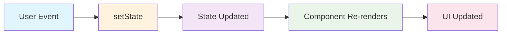
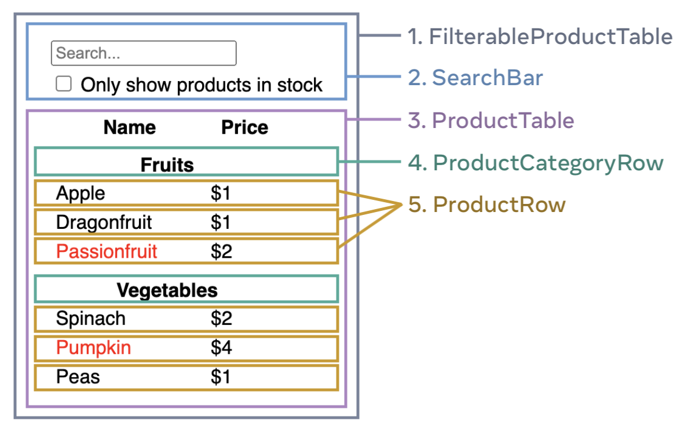

# React

---

## Le basi

--

```html
<html lang="en">
  <head>
    <meta charset="UTF-8">
    <meta 
      name="viewport" 
      content="width=device-width, initial-scale=1.0">
    <title>Document</title>
  </head>
  <body>
    <div class="content">Content</div>
  </body>
</html>
```

--

```css
body {
  padding: 0;
  margin: 0;
  background: #fff;
}

.content {
  max-width: 900px;
  margin: 0 auto;
}
```

--

```js
const el = document.querySelector('.content');

el.innerHTML = "Contenuto aggiornato";
```

`innerHTML` è altamente sconsigliato per ragioni di **sicurezza**

---

## Obiettivi

- modificare il contenuto della pagina
- reagire agli eventi che si verificano (es: click)

---

## React

- sintassi facile e **sicura** per scrivere HTML usando javascript
- **reactive**: permette di modificare l'HTML in seguito ad eventi

---

## JSX

- sintassi simile ad HTML
- in realtà è **javascript** "mascherato"

--

```jsx
<MyComponent textVariable="Contenuto da inserire" />
```

- **C**omponente con l'**iniziale maiuscola**
- attributi `camelCase`
- gli attributi possono contenere anche numeri, booleani, funzioni, array... **\{tra parentesi graffe\}**
  - *(in HTML gli attributi sono sempre stringhe)*

--

Un componente è una funzione javascript  
che ritorna un altro componente/funzione

```jsx
function MyComponent(props) {
  return (
    <div className="content">
      {props.textVariable}
    </div>
  )
}
```

Gli attributi in react si chiamano **props**

--

```jsx
const Page = () => (
  <Layout>
    <Header>
      <Logo img="./company.png" />
      <Navigation activePage="home" />
      <Search />
    </Header>
    <Container>
      <MyComponent textVariable="Contenuto principale" />
    </Container>
  </Layout>
);
```

**Composition**: per ottenere applicazioni complesse, combina diversi componenti in una struttura gerarchica, come in HTML

--

```jsx
function MyComponent({children}) {
  return (
    <div className="content">
      {children}
    </div>
  )
}
```
Per innestare i componenti,  
utilizza la prop **children**

--

Così:

```jsx {data-trim data-line-numbers="2-4"}
<MyComponent>
  <p>
    Contenuto della variabile <em>children</em>
  </p>
</MyComponent>
```

---

## Reactive

Facciamo in modo che l'applicazione si comporti in modo dinamico

--

Passiamo una funzione come parametro a un componente:

```jsx  {data-trim data-line-numbers="3-7"}
<Search 
  onSearch={
    async (searchQuery) => {
      const searchResults = await 
        fetch('http://api.com/search?' + searchQuery);
      setContent(searchResults);
    }
  } 
/>
```

Si può fare perché le funzioni sono **first class objects**

--

Ora vediamo come quella funzione viene utilizzata all'interno del componente Search, tramite la prop *onSearch*:

```jsx {data-trim data-line-numbers="|1|3"}
const Search = ({ onSearch }) => {
  return (
    <form onSubmit={ () => onSearch(what) }>
      Cerca:
      <input type="text" name="what" />
    </form>
  )
}
```

> Attenzione: pseudo-code

--

Un passo indietro: cos'è quel `setContent`?

```jsx  {data-trim data-line-numbers="5"}
<Search 
  onSearch={async (searchQuery) => {
    const searchResults = await 
      fetch('http://api.com/search?' + searchQuery);
    setContent(searchResults);
  }} 
/>
```

--

E' un `hook` di React, che permette di gestire una variabile di stato.

```jsx {data-trim data-line-numbers="|2|8|2|10"}
const Page = () => {
  const [content, setContent] = useState("Contenuto iniziale");
  return (
    <Layout>
      <Search onSearch={async (searchQuery) => {
        const searchResults = await 
          fetch('http://api.com/search?' + searchQuery);
        setContent(searchResults);
      }}/>
      <MyComponent textVariable={content} />
    </Layout>
  );
}
```

--

Quando cambia lo stato di un compomente, la funzione che lo rappresenta viene eseguita nuovamente (rendering) con il valore di stato aggiornato.



--

In React, l'interfaccia è una funzione dello stato:

`UI = f(state)`

> Per modificare l'interfaccia bisogna cambiare il suo stato

--

## Approfondisci

- [React.dev](https://react.dev/learn)

---

## Gestisci lo stato

Lo stato è la "memoria interna" di un componente

```jsx
function MyButton() {
  const [count, setCount] = useState(0);
  // ...
  return <div></div>
}
```

--

```jsx
function MyButton() {
  const [count, setCount] = useState(0);
  // ...
  return <div></div>
}
```

- `useState(initialValue)`: imposta un valore iniziale (zero, nell'esempio)
- `count`: il valore corrente dello stato
- `setCount`: una funzione che serve per modificare il valore di `count`

--

```jsx
function MyButton() {
  const [count, setCount] = useState(0);
  const handleClick = () => setCount(count + 1);
  return <button onClick={handleClick}>
    Clicked {count} times
  </button>
}
```

Ad ogni click di `button`, il counter viene incrementato e il suo valore viene visualizzato all'interno del pulsante (variabile di stato `{count}`)

--

[Prova ad usare le funzionalità di **stato** sulla documentazione ufficiale di React](https://react.dev/learn#updating-the-screen)

---

## Stato condiviso

A volte vogliamo che lo stato di un componente sia utilizzabile anche in un altro componente.

--

Individua il componente **comune** più vicino

```jsx {data-trim data-line-numbers="|1,8"}
<div class="container>
  <div class="column">
    <HandleState /> {/* Modifica lo stato */}
  </div>
  <div class="column">
    <DisplayState /> {/* Visualizza o stato */}
  </div>
</div>
```

--

Trasformiamo il `<div>` in un Componente

```jsx {data-trim data-line-numbers="1,8"}
<Container>
  <div class="column">
    <HandleState /> {/* Modifica lo stato */}
  </div>
  <div class="column">
    <DisplayState /> {/* Visualizza o stato */}
  </div>
</Container>
```

--

In quel componente puoi gestire lo stato a cui accedono i componenti figli

```jsx {data-trim data-line-numbers="|2|7|10"}
const Container = () => {
  const [state, setState] = useState('initial');

  return (
    <div class="container>
      <div class="column">
        <HandleState onClick={setState} />
      </div>
      <div class="column">
        <DisplayState value={state} />
      </div>
    </div>
  )
}
```

--

[Prova ad usare lo **stato condiviso** nell'esempio sulla documentazione ufficiale di React](https://react.dev/learn#sharing-data-between-components)

---

## React Context

Si usa quando lo stato di un componente deve essere utilizzato da un altro componente, che si trova molto lontano nell'alberatura

--

Esempio

```jsx
<ComponentWithState> // questo componente contiene uno stato
  <Nested>
    <Nested>
      <Nested>
        <Nested>
          <TargetComponent /> // ...che deve essere usato qui
        </Nested>
      </Nested>
    </Nested>
  </Nested>
</ComponentWithState>
```

--

```jsx
function ComponentWithState() {
  const [state, setState] = useState();
  return <Nested state={state}/>
}
```

Usando la tecnica delle props, il componente Nested fa solo da passacarte

```jsx
function Nested({state}) {
  return <TargetComponent state={state}/>
}
```

--

Context permette di scavalcare i passacarte e rendere disponbile lo stato a qualsiasi livello innestato

--

```jsx {data-trim data-line-numbers="1,5,7"}
export const Context = createContext();
function ComponentWithState() {
  const [state, setState] = useState();
  return (
    <Context.Provider value={state}>
      <Nested /> // non fa più da passacarte
    </Context.Provider>
  )
}
```

```jsx {data-trim data-line-numbers="2"}
function TargetComponent() {
  const state = useContext(Context);
  // ...utilizza lo stato del componente superiore
  return "..."
}
```

---

## Side effects

Hai notato che per modificare lo stato di un componente abbiamo sempre utilizzato `onClick`?

Questa funzione è un **event handler**, che ci permette di modificare lo stato quando l'utente esegue un'azione.

--

Ma talvolta lo stato deve essere modificato in base ad altri *eventi*, non generati dall'utente.

Chiameremo questi eventi **side effects**.

--

Oppure, quando avviene un cambiamento di stato e deve essere invocata una funzione esterna: anche questo è un **side effect**.

--

Per gestire i **side effects**  
utilizzeremo un altro *hook* di React:

```jsx {data-trim data-line-numbers="3-5"}
const Component = () => {

  useEffect(() => {
    // side effect code 
  }, [dependencies]);

  return <>...qualcosa</>
}
```

--

Un utilizzo tipico:  
visualizzare il contenuto di una pagina 

```jsx
const Component = ({ pageName }) => {
  const [pageContent, setPageContent] = useState("");

  useEffect(() => {
    fetch('/api/' + pageName)
      .then(res => res.json())
      .then(setPageContent);
  }, [pageName]);

  return <>{pageContent}</>
}
```

Quando cambia `pageName` viene invocata l'api che va a modificare la variabile `pageContent`.

---

## Tips

```jsx
<div>
  {isLoggedIn ? (
    <AdminPanel />
  ) : (
    <LoginForm />
  )}
</div>
```

- operatori ternari per il conditional rendering

--

```jsx
<div>
  {isLoggedIn && <AdminPanel />}
</div>
```

- usa l'operatore logico booleano `&&` al posto di *if()*

--

```jsx
const listItems = products.map(product =>
  <li key={product.id}>
    {product.title}
  </li>
);

return (
  <ul>{listItems}</ul>
);
```

- usa i metodi degli array

--

```jsx
function MyButton() {
  const [count, setCount] = useState(0);
  return (
    <button onClick={() => setCount(count + 1)}>
      Clicked {count} times
    </button>
  );
}

export default function MyApp() {
  return (
    <MyButton />
    <MyButton />
  );
}
```

- ogni componente ha il suo stato

--

```jsx {data-trim data-line-numbers="|10"}
function MyButton({count, setCount}) {
  return (
    <button onClick={() => setCount(count + 1)}>
      Clicked {count} times
    </button>
  );
}

export default function MyApp() {
  const [count, setCount] = useState(0);
  return (
    <MyButton count={count}, setCount={setCount}/>
    <MyButton count={count}, setCount={setCount}/>
  );
}
```

- stato condiviso tra più componenti

---

## Errori da evitare

--

```jsx {data-trim data-line-numbers="4"}
function MyButton() {
  const [count, setCount] = useState(0);
  return (
    <button onClick={() => { count = count + 1 }}> // NO!
      Clicked {count} times
    </button>
  );
}
```

- non modificare lo stato direttamente, utilizza sempre la funzione `setState` (in questo esempio: `setCount`)

--

```jsx {data-trim data-line-numbers="1,3"}
function MyButton({count}) {
  return (
    <button onClick={() => { count = count + 1 }}> // NO!
      Clicked {count} times
    </button>
  );
}
```

- **rispetta** il flusso di dati, sempre dall'alto verso il basso. Non modificare una proprietà di un componente di livello superiore (in questo esempio: una `prop`) 

--

```jsx {data-trim data-line-numbers="1,3"}
function MyButton({count, setCount}) {
  return (
    <button onClick={() => {setCount(count + 1)}}>
      Clicked {count} times
    </button>
  );
}
```

Un componente figlio può modificare lo stato di un genitore, se gli viene fornita una funzione per modificarlo (tramite props o context)

---

## Thinking in React

Ovvero: come procedere quando realizzi un'applicazione React

--



- disegna una **gerarchia di componenti**

--

- costruisci una versione **statica** in React

--

- progetta una rappresentazione minima ma completa dello stato
- identifica dove implementare lo stato
  - quali componenti devono gestire lo stato?
  - qual è il primo genitore comune di due componenti che devono condividere lo stesso stato?
  - **lift state up**

--

- implementa le prop che contengono le funzioni di callback (**inverse data flow**)

--

## Approfondisci

[React.dev](https://react.dev/learn/thinking-in-react)

---

## Inizializzare l'applicazione

```html {data-trim data-line-numbers="4"}
<html>
  <head></head>
  <body>
    <div id="app"></div>
  </body>
</html>
```

```jsx {data-trim data-line-numbers="3,4"}
import { createRoot } from 'react-dom/client';
import { Page } from './Page.jsx'
const root = createRoot(document.getElementById('app'));
root.render(<Page />);
```

---

## Librerie

--

Utilizzare una libreria di componenti (UI Kit): [MUI](https://mui.com/joy-ui/getting-started/)

```tsx
export const MyCard: React.FC = () => {
  return (
    <Card>
      <CardMedia
        component="img"
        alt="Yosemite National Park"
        image="/static/images/cards/yosemite.jpeg"
      />
      <Stack direction="row" alignItems="center" spacing={3} p={2} useFlexGap>
        <Stack direction="column" spacing={0.5} useFlexGap>
          <Typography>Yosemite National Park, California, USA</Typography>
          <Stack direction="row" spacing={1} useFlexGap>
            <Chip
              size="small"
              label={active ? 'Active' : 'Inactive'}
              color={active ? 'success' : 'default'}
            />
            <Rating defaultValue={4} size="small" />
          </Stack>
        </Stack>
        <Switch checked={active} />
      </Stack>
    </Card>
)};
```

--

Utilizzare una libreria per il routing: 
[React Router](https://reactrouter.com/en/main)

```tsx
function App() {
  return (
    <BrowserRouter basename="/">
      <Routes>
        <Route index element={<Home />} />
        <Route path="about" element={<About />} />

        <Route element={<AuthLayout />}>
          <Route path="login" element={<Login />} />
          <Route path="register" element={<Register />} />
        </Route>

        <Route path="concerts">
          <Route index element={<ConcertsHome />} />
          <Route path=":city" element={<City />} />
          <Route path="trending" element={<Trending />} />
        </Route>
      </Routes>
    </BrowserRouter>
  );
}
```